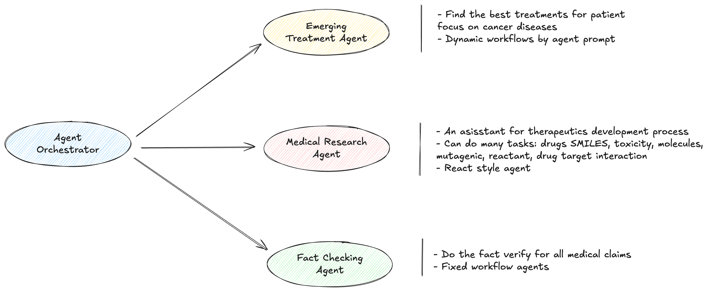
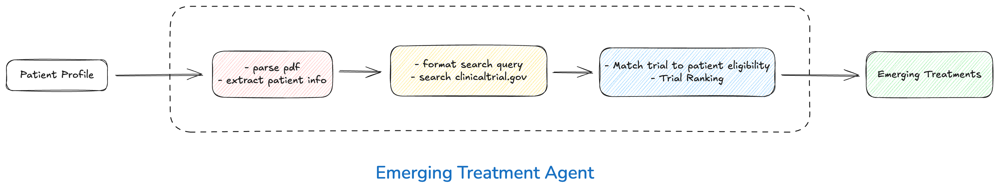
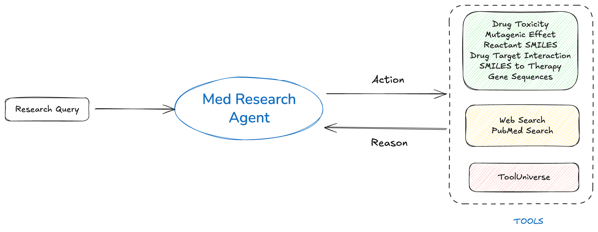
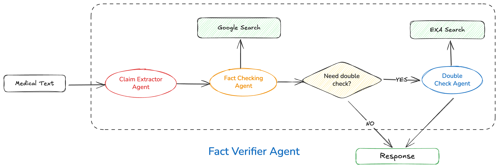

# TriangleAgent

**TriangleAgent** is a modular, multi-agent system designed for advanced medical research, clinical trial matching, and emerging treatment discovery. It leverages large language models (LLMs), web search, and domain-specific tools to deliver evidence-based, actionable insights for clinicians, researchers, and patients.


## Project Overview


## Emerging Treatment Agent


## Medical Research Agent


## Fact Verifier Agent


### [Detail Project Description](https://deepwiki.com/doanthuan/triagent)

## Features

- **Medical Deep Research Agent**: Performs comprehensive, evidence-based research on complex medical and scientific topics, synthesizing information from reputable sources and PubMed.
- **Clinical Trial Matching**: Extracts patient data, searches for relevant clinical trials, and ranks them based on patient eligibility and relevance.
- **Emerging Treatment Discovery**: Suggests innovative and experimental treatments based on the latest research and patient-specific molecular/genetic characteristics.
- **Drug Property Prediction**: Predicts drug toxicity, mutagenic effects, drug synergy, and drug-target interactions using SMILES strings and other molecular data.
- **Multi-Agent Architecture**: Modular agents for research, trial matching, and verification, each with specialized prompts and tools.

## Project Structure

```
src/triagent/
  agents/
    tx_emerging/    # Agents and tools for emerging treatments and clinical trial matching
    tx_research/    # Agents and tools for deep medical research
    tx_verifier/    # Agents for fact verification and validation
  config.py         # Configuration and settings
  logging.py        # Logging utilities
  tests/            # Test cases and sample patient summaries
```

## Example Use Cases

- **Research Agent**: "What are the latest treatment options for glioblastoma with specific genetic mutations?"
- **Trial Matching**: "Find clinical trials for a patient with stage IV pancreatic cancer and BRCA-2 mutation."
- **Emerging Treatments**: "Suggest novel therapies for a patient with treatment-resistant DIPG."

## How to run it

1. **Install dependencies**:
   ```
   pip install -r requirements.txt
   ```
2. **Configure API keys**: Set up your `.env` file with the required API keys (OpenAI, Gemini, etc.) as specified in `config.py`.
3. **Run local agents**:

   ```
   cd src
   adk web
   ```
4. **Deploy to Google Agent Engine**: follow steps in src/deploy.ipynb notebook

## License

[MIT License](LICENSE) (or specify your license) 